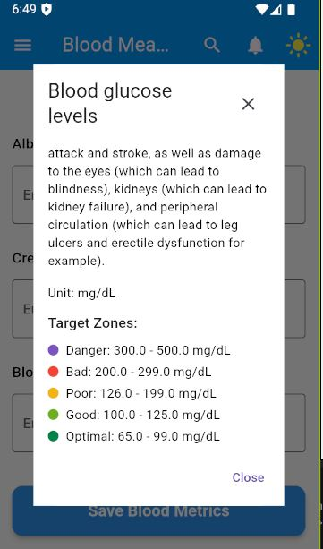

# 🧬 Longevity Tracker App

**An Advanced personal health optimization app built in Flutter**

| Home & Overview | Biological Age | Dark Mode |
|---|---|---|
|  |  |  |

| Metrics Entry | Explanations | Achievements |
|---|---|---|
|  |  |  |

| Organs Overview | Notifications | Search Metric |
|---|---|---|
|  |  |  |

---

## Features

✅ **60+ Biometrics** tracked over time  
✅ **Biological Age Estimation** (PhenoAge algorithm)  
✅ **Daily & Weekly Health Scores**  
✅ **Achievements & Gamification**  
✅ **Organ Health Dashboard** (Cardio, Brain, Metabolic, etc.)  
✅ **Optimal, normal and Danger Zones** for each biomarker  
✅ **Notifications & Reminders**  
✅ **Advanced Visualizations & Trends**  
✅ **Built in Flutter**  
✅ **Smartwatch Integration** *(coming soon)*  

---

## Technology Stack

- **Flutter** for cross-platform mobile development
- **Scientifically accurate algorithms** for biological age estimation like phenoAge from Dr. Morgan Levine
- **JSON-based data storage** (local persistence)

> **Note:** This repository does not contain source code. For demonstration only.

## Contact Me

If you’d like to learn more about this project or discuss collaboration:

**Simon Penelle**  
Email: [simon@penelle.net]
Linkedin: [[https://www.linkedin.com](https://www.linkedin.com/in/simon-penelle-aaa258210/)]

---

